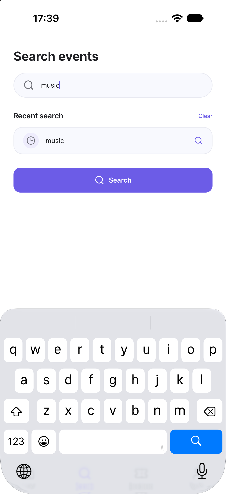
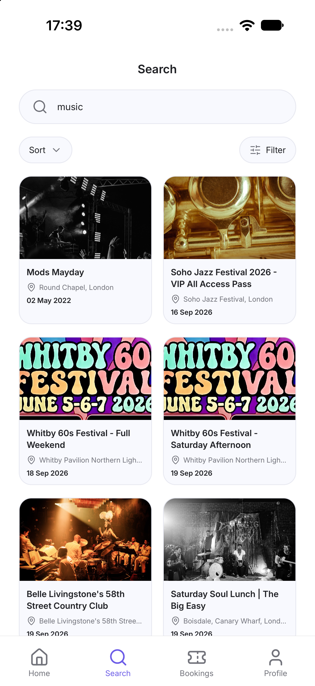
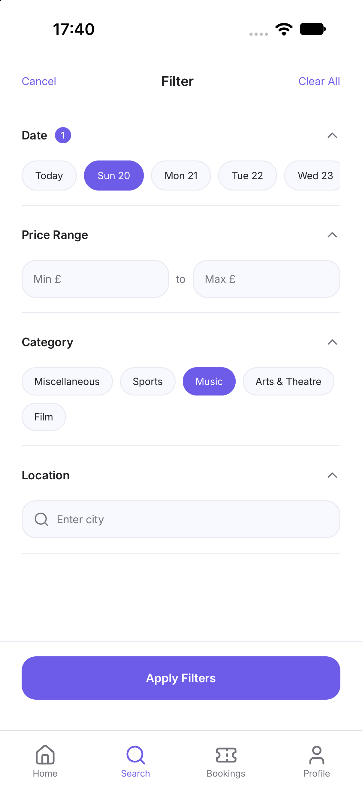
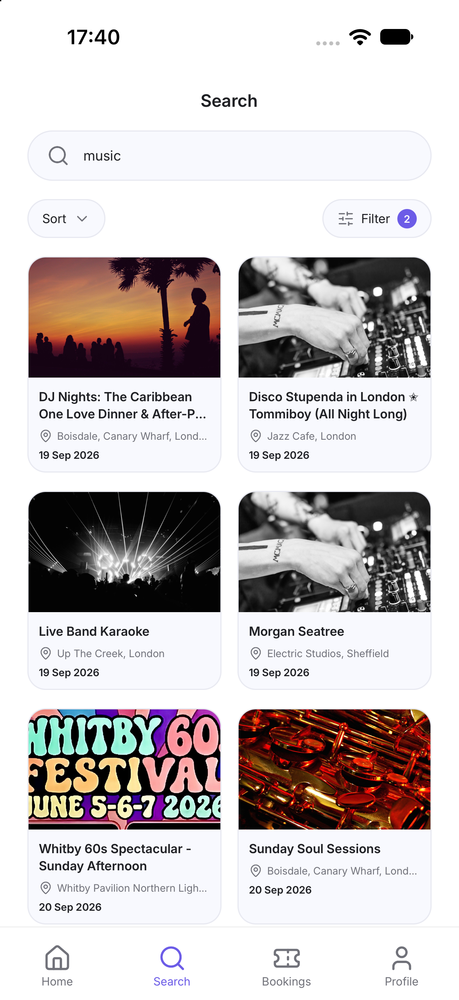
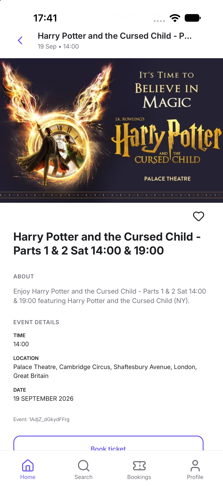

# Evently

Event discovery and ticket booking mobile application built with React Native.

## Assignment 5

For this assignment, the application was integrated with the Ticketmaster Discovery API.

### API

Ticketmaster Discovery API was used to retrieve real event data.

The application supports:

- Event search
- Event categories
- Event filtering
- Date filtering
- Price filtering
- Location filtering
- Sorting
- Event details
- Navigation from event list to event details

### Technologies

- React Native
- TypeScript
- React Navigation
- Fetch API
- Ticketmaster Discovery API
- FlatList
- lucide-react-native

### API integration

API request logic is separated into:

`src/api/api.ts`

The application uses `fetch()` for GET requests and stores received data in React state using `useState`.

### Loading and error handling

Loading states are displayed using `ActivityIndicator`.

API errors are handled with `try/catch` and displayed to the user.

### Screenshots

#### Home

#### Search

#### Search Results

#### Filters

#### Filter Results

#### Event Details

#### Live Demo

