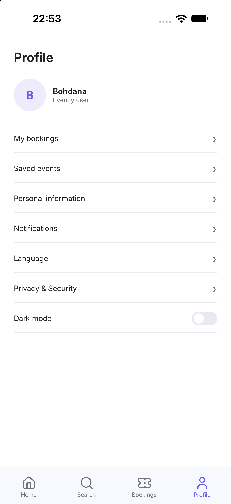
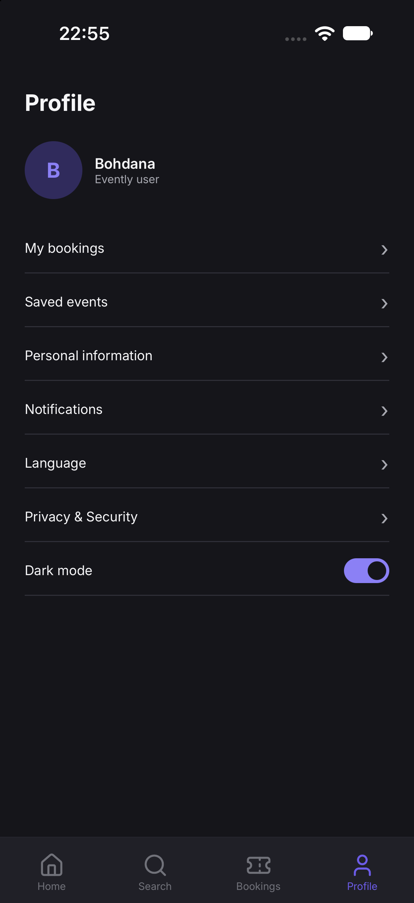
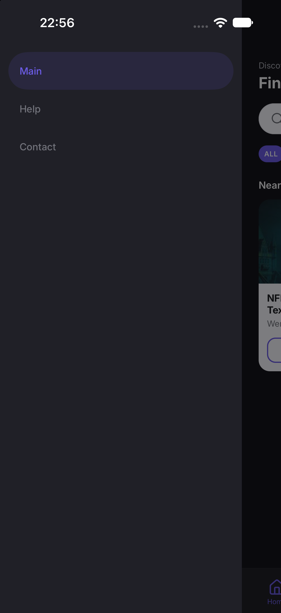
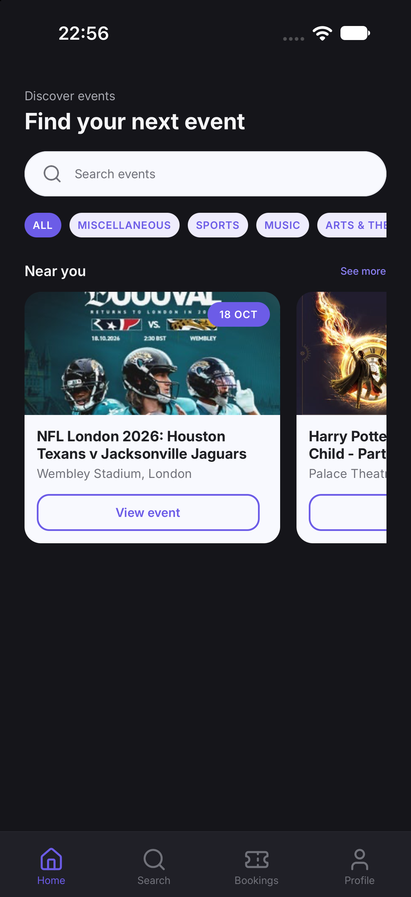
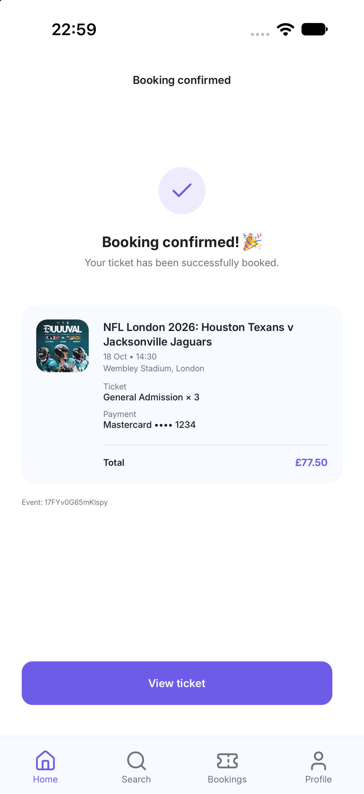
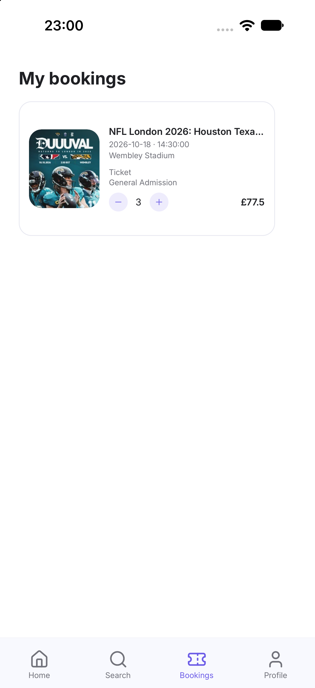

# Evently

Event discovery and ticket booking mobile application built with React Native.

## Cross Assignment 6

This assignment focuses on global state management in the Evently React Native application.

The project uses:

- Context API for global theme management

- Redux Toolkit for booking management

- React Navigation theme integration

- TypeScript for type safety

## Context API

The Context API is used to manage the global application theme.

### Theme features

- Light and Dark themes
- Global theme state
- Theme toggle from the Profile screen
- Theme colors are centralized in `theme.ts`
- React Navigation theme changes together with the application theme

### Implementation

The main files are:

- `src/context/ThemeContext.tsx`
- `src/constants/theme.ts`
- `src/screens/ProfileScreen.tsx`
- `src/screens/HomeScreen.tsx`
- `src/navigation/RootNavigator.tsx`

## Screenshots

### Context API - Light Theme

### Context API - Dark Theme

### Dark Theme Navigation

### Home Dark Theme

## Redux Toolkit

Redux Toolkit is used to manage global booking state.

### Booking features

- Add a booking after successful payment
- Store event information
- Store ticket type and quantity
- Update ticket quantity
- Remove/cancel a booking
- Display bookings on the My Bookings screen
- Calculate the booking total including the service fee

### Implementation

The main Redux files are:

- `src/redux/store.ts`
- `src/redux/bookingsSlice.ts`
- `src/screens/BookingConfirmedScreen.tsx`
- `src/screens/BookingsScreen.tsx`
- `src/components/BookingItem.tsx`

## Screenshots

### Booking Confirmation

### My Bookings

### Booking Cancellation

## State Management Architecture

### Context API

Theme state:

`ThemeProvider`
→ `useTheme()`
→ `ProfileScreen`
→ `HomeScreen`
→ `RootNavigator`

### Redux Toolkit

Booking state:

`Provider`
→ `store`
→ `bookingsSlice`
→ `BookingConfirmedScreen`
→ `BookingsScreen`
→ `BookingItem`

### Live Demo

