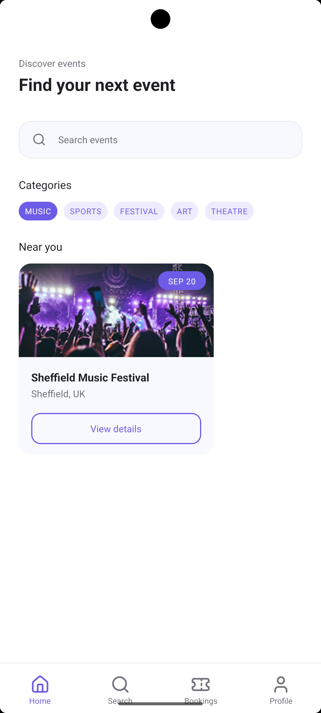
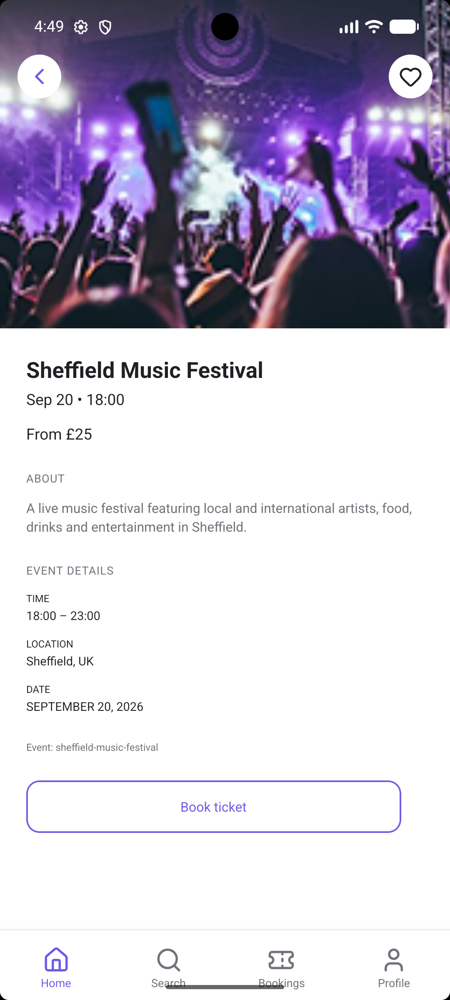
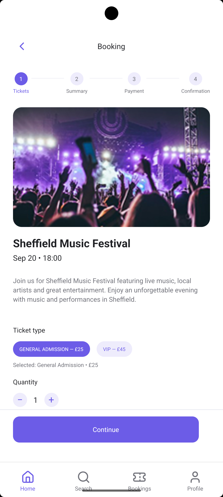
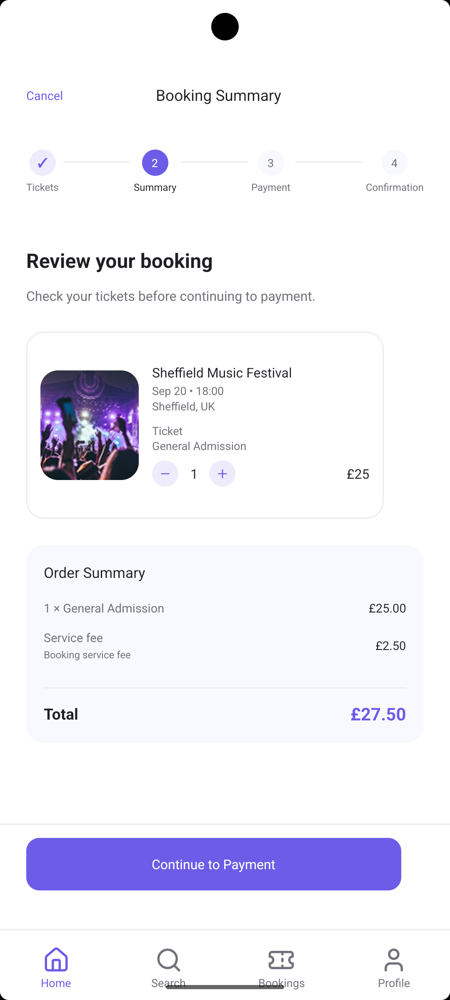
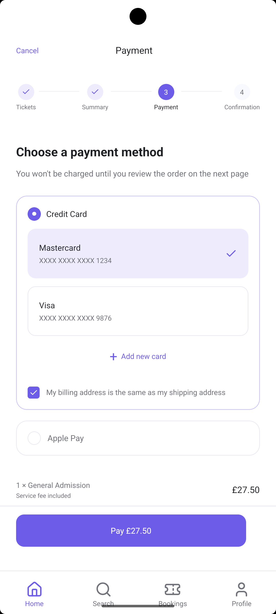
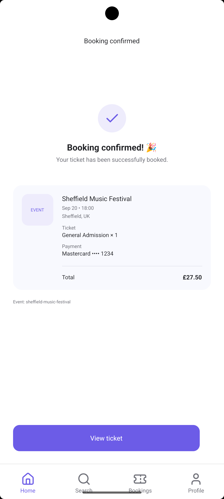
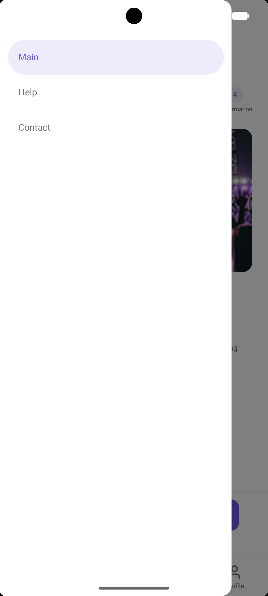

# Evently

React Native mobile application for discovering events and booking tickets.

## Assignment 4 - Navigation

This assignment focuses on implementing a complete navigation structure for the Evently mobile application based on the Figma design.

The application uses React Navigation with:

- Stack Navigator
- Bottom Tab Navigator
- Drawer Navigator

## Navigation Structure

```text
Drawer Navigator
│
├── Main
│   │
│   └── Bottom Tab Navigator
│       │
│       ├── Home
│       │   │
│       │   └── Home Stack
│       │       ├── Home
│       │       ├── Event Details
│       │       ├── Booking Tickets
│       │       ├── Booking
│       │       ├── Payment
│       │       └── Booking Confirmed
│       │
│       ├── Search
│       ├── Bookings
│       └── Profile
│
├── Help
└── Contact
```

## Stack Navigation

The Home Stack is used for the main event and booking flow:

Home
 ↓
Event Details
 ↓
Booking Tickets
 ↓
Booking
 ↓
Payment
 ↓
Booking Confirmed

Stack navigation allows users to move through the booking process and return to previous screens using back navigation.

## Bottom Tab Navigation

The main sections of the application are available through bottom tabs:

* Home
* Search
* Bookings
* Profile

## Drawer Navigation

The Drawer provides access to secondary sections:

* Main
* Help
* Contact

The Drawer can be opened using a swipe gesture from the left edge of the screen.

## Navigation Parameters

Navigation parameters are used to pass event and booking information between screens.

For example, the event ID is passed from Event Details to Booking Tickets:
```
navigation.navigate('BookingTickets', {
    eventId,
});
```
The destination screen receives the parameter using route.params:
```
const { eventId } = route.params;
```

Booking screens also receive:

* event ID
* ticket quantity
* ticket type
* ticket price
* payment method

This allows booking information to be preserved throughout the booking flow.

## Error Handling

Screens that require navigation parameters include basic validation.

If a required parameter is missing, the application displays an error state instead of trying to render unavailable data.

## Search

The Search screen allows users to search for events.

Search results are matched by:

* event title
* location
* category

Example: music

returns: Sheffield Music Festival

## Booking Flow

The complete ticket booking flow is implemented:

Event Details
 ↓
Booking Tickets
 ↓
Booking
 ↓
Payment
 ↓
Booking Confirmed

The selected event and booking information are passed between screens using React Navigation parameters.

## Reusable Components

The application uses reusable React Native components created in the previous assignment:

* CustomButton
* EventCard
* SearchBar
* CategoryList
* BookingItem
* EventInfo
* TabBar

## Technologies

* React Native
* TypeScript
* React Navigation
* React Navigation Native Stack
* React Navigation Bottom Tabs
* React Navigation Drawer
* React Native Gesture Handler
* React Native Reanimated
* React Native Safe Area Context
* lucide-react-native
* StyleSheet
* Flexbox

## Responsive Design

The application was tested on Android and iOS.

Responsive layouts use React Native dimensions and safe area handling.

Platform-specific behavior is handled using React Native APIs such as:

- Platform.select()
- useWindowDimensions()

## Screenshots

### Home



### Event Details



### Booking






### Drawer



## Navigation Demo

The navigation flow was recorded on Android.

The video demonstrates:

* Bottom Tab Navigation
* Drawer Navigation
* Stack Navigation
* Search
* Search results
* Navigation parameters
* Event Details
* Ticket selection
* Booking
* Payment
* Booking confirmation
* Back navigation

[Watch Navigation Demo](https://drive.google.com/file/d/1eQx0YTy2ZX8m5GGz1X-wYrOxmPNOd5qW/view?usp=sharing)

## Author

Bohdana Olkhovetska
