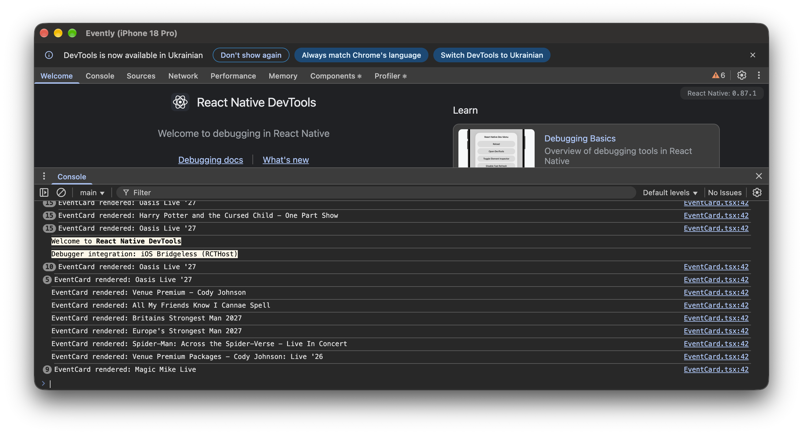
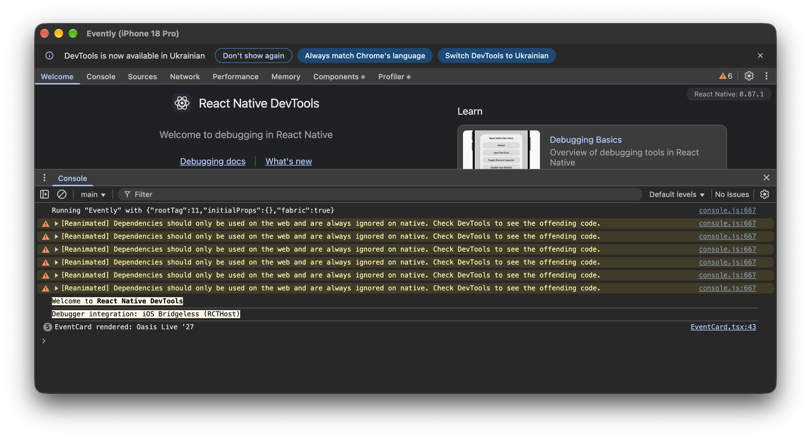
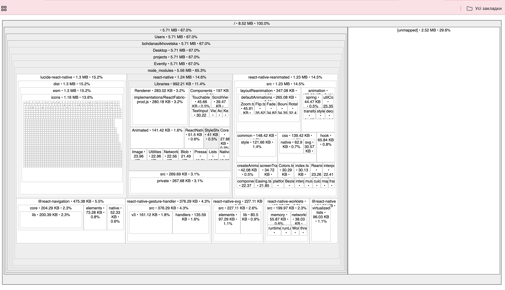
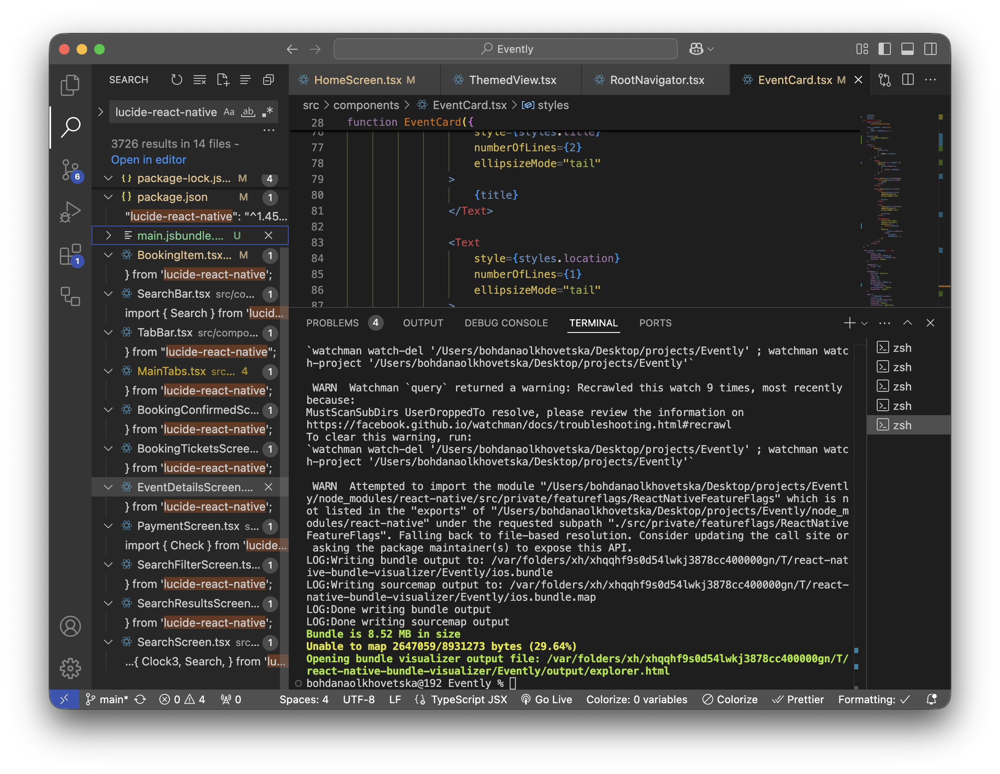
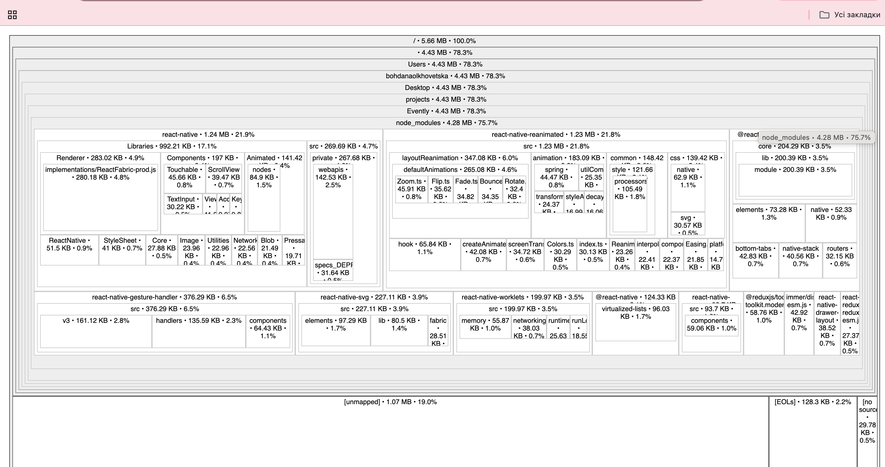
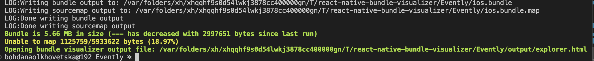

# Evently

Evently is a React Native mobile application for discovering events and booking tickets.

The project was developed as part of the Cross-Platform Mobile Development course.

## Assignment 7: Performance Optimization

This assignment focuses on improving application performance through:

- UI animation
- reducing unnecessary component re-renders
- dependency optimization
- bundle size analysis

---

## 1. Animation

A visible animation was added to the `BookingItem` component.

When the ticket quantity changes, the quantity value briefly scales up and smoothly returns to its original size.

The animation is implemented using `react-native-reanimated` with:

- `useSharedValue`
- `useAnimatedStyle`
- `withSequence`
- `withTiming`
- `withSpring`

This provides visual feedback when the user increases or decreases the ticket quantity.

### Animation

[Ticket quantity animation](https://drive.google.com/file/d/16psDAnR91BX2o1HgCxmorQX7QA1nbJrL/view?usp=sharing)

---

## 2. Render Optimization

The `EventCard` component is rendered multiple times on the Home screen, making it a suitable component for optimization.

The following React optimization techniques were applied:

### React.memo

`EventCard` was wrapped with `React.memo()` to prevent unnecessary re-renders when its props have not changed.

### useCallback

Event handlers and render functions were memoized with `useCallback` to keep stable function references.

### useMemo

Derived event data, category data and styles were memoized with `useMemo` where appropriate.

These optimizations reduce unnecessary work when the Home screen updates.

### Before optimization



### After optimization



---

## 3. Dependency Optimization

The project was inspected for dependencies that could increase the JavaScript bundle size.

`lucide-react-native` was identified as a significant contributor to the bundle.

The icon library was kept because it is actively used in the application. 
Instead, the imports were optimized to use individual icon modules, reducing the amount of unused icon code included in the bundle.

### Before

```tsx
import {
    Search,
    Heart,
    ChevronLeft,
} from 'lucide-react-native';
```

### After
```tsx
import Search from 'lucide-react-native/icons/search';
import Heart from 'lucide-react-native/icons/heart';
import ChevronLeft from 'lucide-react-native/icons/chevron-left';
```
This allows Metro to include only the icon modules that are actually used by the application.

All existing icons remain functional and visually unchanged.

## 4. Bundle Analysis

The JavaScript bundle was analyzed using react-native-bundle-visualizer.

### Before optimization

* Bundle size: 8.52 MB
* Unmapped content: 29.64%




### After optimization

* Bundle size: 5.66 MB
* Unmapped content: 18.97%




The bundle size decreased by approximately 2.86 MB, which is about a 33.6% reduction compared with the initial bundle.

The optimization was achieved without removing any required application functionality.

## 5. Dependency Cleanup

Unused dependencies were also removed from the project.

The following packages were removed because they were not used in the application:

* @react-navigation/stack
* @react-native/new-app-screen

lucide-react-native was kept because the application uses its icons.

## 6. Technologies

* React Native
* TypeScript
* React Navigation
* Redux Toolkit
* React Context API
* React Native Reanimated
* React Native Gesture Handler
* React Native SVG
* Ticketmaster Discovery API
* react-native-config